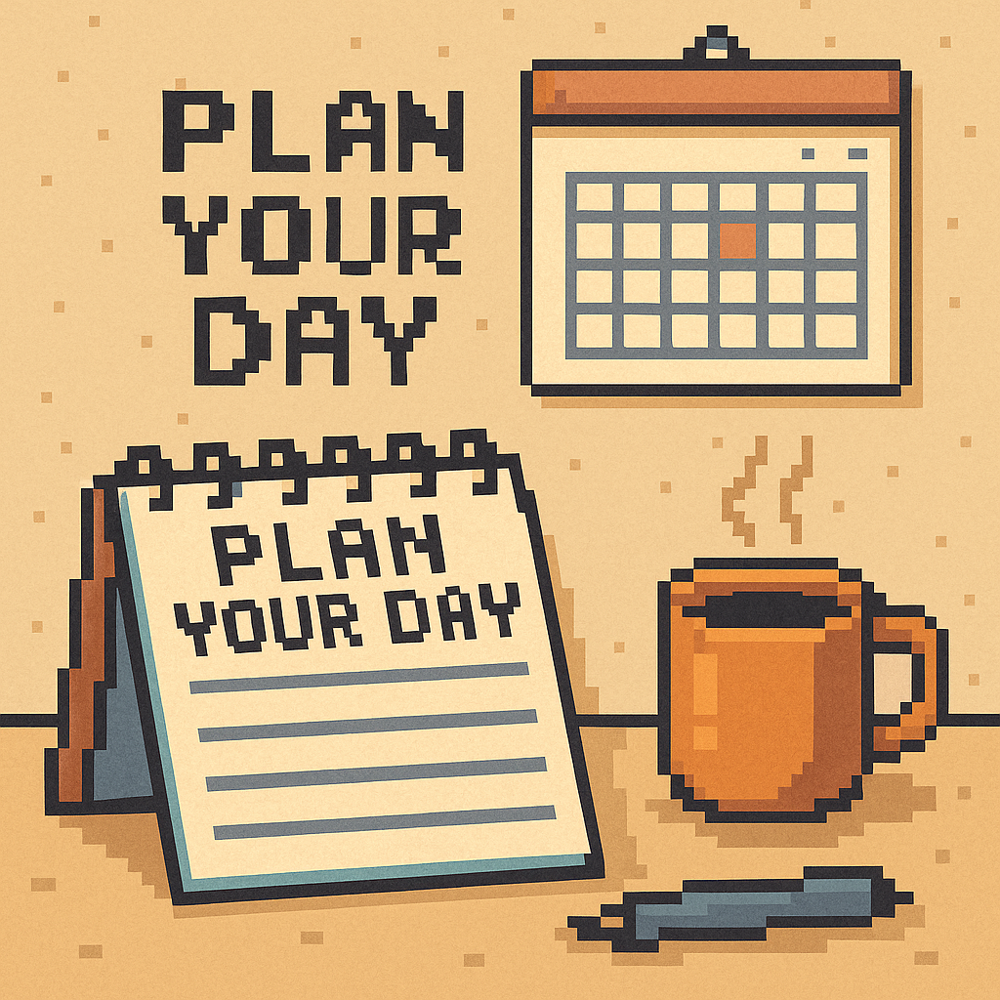

+++
date = '2025-11-08T18:38:45+03:00'
draft = false
title = 'Как я спланировал день поминутно и что из этого вышло'
image = 'cover.png'
description = 'Поминутное планирование как инструмент от прокрастинации и путь к осознанной жизни'
+++

Долго жил на автопилоте. Дел навалом: работа, учёба, личные вопросы. Списки росли, дедлайны подпирали, чувство вины стало фоном. Я пробовал разные системы, но они быстро рассыпались. Не хватало простого и жёсткого порядка.

Перелом случился, когда один студент рассказал, как за три месяца поднял разговорный арабский с нуля. Его секрет был в поминутном планировании. Меня зацепило. Значит, дело не в таланте, а в структуре дня. Я взял этот подход и применил к своей жизни.

## Что значит поминутно в моём понимании

Это не про излишний перфекционизм и не про дыхание по расписанию. Суть в другом: у каждой задачи есть начало, конец и место в дне. Никаких потом и как получится. Есть конкретный слот и понятный результат.

Главное правило: дни без серых зон. Если время ничьё, его съедает прокрастинация. Когда каждый промежуток назначен, мозг перестаёт спорить и просто делает.

## С чего я начал

Сначала определил направления, в которых хочу расти: разработка, спорт, религия, семья и личные дела. Не пытался охватить всё сразу. Поставил приоритеты и закрепил за каждым направлением своё время.

Дальше разложил неделю. Каждый день получил несменяемый каркас из крупных блоков. Внутри блоков оставил место под конкретные задачи. Это и есть поминутно: не абстрактное утро поучиться, а чёткие отрезки со списком дел.

## Как устроено моё утро

Утро самое тихое. Его я отдал iOS-разработке. Разбил обучение на модули: многопоточность, архитектура и другие темы. В идеале один модуль в неделю. Если тема сложная, растягиваю до месяца. Смысл в стабильности, а не в гонке.

После каждого занятия проверяю два пункта: что понял и что сделал руками. Если не могу ответить коротко, значит знаний нет. Ставлю повтор в ближайший свободный слот. Так работает мой контроль результатов.

## Как я держу ритм без выгорания

Я не гонюсь за количеством часов. Для меня важнее постоянный темп. Когда модули идут один за другим, прогресс становится ощутимым. Тревога уходит, возвращается ощущение контроля.

Я не штрафую себя за коррекции. Жизнь не обязана влезать в план. Если что-то сдвинулось, я не ломаю весь день, а меняю местами блоки. Каркас остаётся, и это спасает от чувства провала.

## Что изменилось

Поминутное планирование стало **таблеткой от прокрастинации**. Исчезли пустые просадки между задачами. Я успеваю больше и чувствую себя спокойнее. Структура даёт ясность. Я вижу текущие дела и долгосрочную траекторию.

Стало проще говорить нет лишнему. Когда день расписан, видно цену любого да. Решения перестали быть эмоциональными. Они опираются на расписание.

Появилось ощущение накопления результата. Не просто занимался разработкой, а закрыл модуль. Не просто занялся собой, а выделил время семье, тренировке, чтению. У каждой сферы есть внимание, а не остатки по вечерам.

## О ловушках, которые я обошёл

Я не превращал план в жестокий регламент. Нет смысла делать вид, что живёшь в лаборатории. План это инструмент, а не начальник. Он помогает, пока остаётся гибким.

Я избегал универсальных рецептов. Мне подошли утренние слоты под сложную работу и модульная схема обучения. Другому зайдут вечерние. Важен не шаблон, а честный учёт своих ресурсов.

И ещё одно. Я не путал детальность и мелочность. Детально значит понятно, что и когда я делаю. Мелочно значит контроль съедает энергию. Мне достаточно видеть крупные блоки и конечный результат на отрезке недели.

## Почему это работает

План снимает с мозга лишние переговоры. Не нужно каждый раз заново решать, чем заняться. Решение принято заранее, энергия уходит в действие.

Структура даёт измеримость. Модуль закрыт, значит есть результат. Неделя прошла, значит видно прогресс. Измеримость рождает мотивацию. Хочется довести начатое, а не начинать заново.

Самое важное: план возвращает чувство авторства. День не случился сам по себе. День состоялся так, как я задумал. Это ощущение тянет вверх в работе и в личной жизни.

## Что я вынес из этого опыта

Планирование это навык, а не озарение. Его можно поставить на рельсы и держать в тонусе. Для меня ключевая связка простая: сферы, блоки, модули, контроль результата.

Я не стал жить быстрее. Я стал жить яснее. Меньше лишнего, больше важного, меньше распыления. Это лучшее, что со мной случилось в плане продуктивности и спокойствия.

Если вы устали от ощущения гонки, попробуйте мой путь. Распишите день поминутно, привяжите задачи к конкретным слотам и выберите стабильность вместо рывков. На старте потребуется дисциплина, но отдача приходит быстро. Появится воздух, появится фокус, и вы увидите, как постепенно собирается жизнь, которую вы хотели вести.
